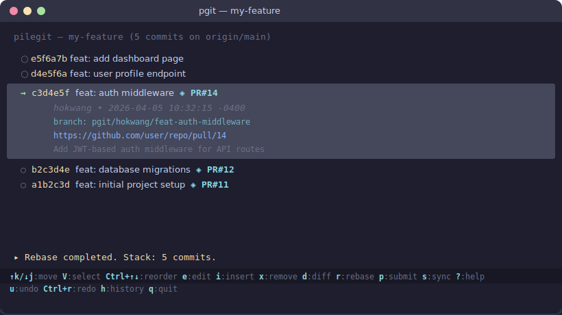

# pilegit (`pgit`)

**Git stacking with style** — manage, squash, reorder, and submit stacked PRs from an interactive TUI.

[](https://github.com/hokwangchoi/pilegit/stargazers)
[](https://github.com/hokwangchoi/pilegit/network/members)
[](LICENSE)

Develop on a single branch, organize commits into reviewable chunks, submit each as a stacked PR. Full undo restores actual git state. Works with GitHub, GitLab, Gitea, Phabricator, and custom commands.

<p align="center">
  
</p>

<!-- Replace with a demo gif once recorded: -->
<!-- <p align="center"></p> -->

## Install

```bash
cargo install --path .
```

## Quick Start

```bash
pgit          # launch TUI (prompts setup on first run)
pgit init     # re-run setup
pgit status   # show stack non-interactively
```

## Keybindings

| Key | Action |
|---|---|
| `j`/`↓` `k`/`↑` | Move cursor |
| `g` / `G` | Top / bottom |
| `Enter` / `Space` | Expand/collapse commit details |
| `d` | Full diff view |
| `V` or `Shift+↑↓` | Start visual selection |
| `Ctrl+↑↓` or `Ctrl+k/j` | Reorder commit (real `git rebase -i`) |
| `e` | Edit/amend commit |
| `i` | Insert new commit (after cursor or at top) |
| `x` | Remove commit from history |
| `r` | Rebase onto base branch + sync PRs |
| `p` | Submit or update PR for commit |
| `s` | Sync all submitted PRs |
| `u` / `Ctrl+r` | Undo / redo (restores git state) |
| `h` | View undo/redo history |
| `?` | Full help screen |
| `q` | Quit |

**Select mode:** `V` to start → `j`/`k` extend → `s` squash → `Esc` cancel  
**Diff view:** `j`/`k` scroll · `Ctrl+d`/`Ctrl+u` half-page · `q` back

## Setup

First run prompts for platform and base branch. Saved to `.pilegit.toml`:

```toml
[forge]
type = "github"    # github | gitlab | gitea | phabricator | custom

[repo]
base = "origin/main"
```

| Platform | CLI | Install |
|---|---|---|
| GitHub | `gh` | [cli.github.com](https://cli.github.com/) |
| GitLab | `glab` | [gitlab.com/gitlab-org/cli](https://gitlab.com/gitlab-org/cli) |
| Gitea | `tea` | [gitea.com/gitea/tea](https://gitea.com/gitea/tea) |
| Phabricator | `arc` | `arc install-certificate` |
| Custom | any | Shell command with `{hash}`, `{subject}` placeholders |

## Stacked PRs

Each commit → one PR. pilegit manages base branches so each PR shows only its diff:

```
Stack:                       PRs:
┌ feat: dashboard            PR#15 base=pgit/.../feat-auth
│ feat: auth middleware       PR#14 base=main (parent merged)
└ feat: migrations            ← merged, branch cleaned up
```

Branch naming: `pgit/<username>/<subject>` — multi-user safe.

Press `s` to sync: force-push all branches, update bases, prompt to clean up stale branches.

## Under the Hood

| Action | Git Operation |
|---|---|
| Reorder | `git rebase -i` with sed |
| Remove | `git rebase -i` → `drop` |
| Squash | `git rebase -i` → `pick` + `squash` |
| Edit | `git rebase -i` → `edit` + `commit --amend` |
| Undo | `git reset --hard <saved-HEAD>` |
| Submit | `git branch -f` + `git push -f` + CLI |
| Rebase | `git fetch origin` + `git rebase origin/main` |

## Forge Trait

Adding a new platform = implementing one trait:

```rust
pub trait Forge {
    fn submit(&self, repo: &Repo, hash: &str, subject: &str,
              base: &str, body: &str) -> Result<String>;
    fn update(&self, repo: &Repo, hash: &str, subject: &str,
              base: &str) -> Result<String>;
    fn list_open(&self, repo: &Repo) -> (HashMap<String, u32>, bool);
    fn edit_base(&self, repo: &Repo, branch: &str, base: &str) -> bool;
    fn mark_submitted(&self, repo: &Repo, patches: &mut [PatchEntry]);
    fn sync(&self, repo: &Repo, patches: &[PatchEntry],
            on_progress: &dyn Fn(&str)) -> Result<Vec<String>>;
    fn name(&self) -> &str;
}
```

## Comparison

| | pilegit | git-branchless | graphite | ghstack |
|---|---|---|---|---|
| Interactive TUI | ✓ | ✓ | – | – |
| Single-branch | ✓ | ✓ | – | ✓ |
| Stacked PRs | ✓ | partial | ✓ | ✓ |
| Multi-platform | 5 | git only | GitHub | GitHub |
| Undo/redo | ✓ | ✓ | – | – |
| No daemon | ✓ | – | – | ✓ |

## Architecture

```
src/
├── main.rs            # CLI — TUI, status, init
├── core/
│   ├── config.rs      # .pilegit.toml + setup wizard
│   ├── stack.rs       # Stack data model
│   └── history.rs     # Undo/redo with HEAD hash tracking
├── git/
│   └── ops.rs         # Git operations (rebase, squash, swap, etc.)
├── forge/
│   ├── mod.rs         # Forge trait + factory
│   ├── github.rs      # GitHub (gh)
│   ├── gitlab.rs      # GitLab (glab)
│   ├── gitea.rs       # Gitea (tea)
│   ├── phabricator.rs # Phabricator (arc)
│   └── custom.rs      # Custom command
└── tui/
    ├── mod.rs         # Terminal + suspend/resume handlers
    ├── app.rs         # State machine (modes, cursor, forge)
    ├── input.rs       # Keybinding dispatch
    └── ui.rs          # Ratatui rendering
```

## License

MIT
